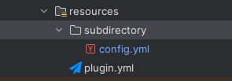

# Config

The config package is designed on top of the existing Bukkit implementation that has carried over into PaperMC. This implementation allows for the saving of comments and the creation of multiple configuration files with custom names and file locations.

## Usage

### Config Initialization

The usage is fairly simple. Just check if the location exists where you want to save the file to and then create the config object.

```java
public void onEnable() {
        // Checks if data folder exists
        if (!plugin.getDataFolder().exists()) {
            plugin.getLogger().info("Datafolder does not Exist. Creating now...");
            if (plugin.getDataFolder().mkdirs()) {
                plugin.getLogger().info("Successfully created datafolder.");
            } else {
                plugin.getLogger().severe("Failed to create the datafolder.");
            }
        }

        //Setting up Config
        config = new Config(plugin, plugin.getDataFolder(), "subdirectory/config", true, true);
        config.init();
        plugin.getLogger().info("Setting up the config.yml...");
```

The above example sets up a configuration file, "config.yml", inside the plugin's data folder under the sub-directory, "subdirectory".

When using a subdirectory, be sure to match your plugin's datafolder structure inside of your plugin's resources folder like so:



NOTE: The config class handle's adding the .yml if it is not present so the file could alternatively be named "config.yml" and Config.java would handle that accordingly.

### Accessing Config Attributes
Accessing attributes is similar to the default Bukkit implementation. The plugin features enhanced getters for a few data types, but ultimately all data types can be accessed through Config.getConfig() which returns PaperMC's FileConfiguration object.

```java
// Load the Database file
String dbType = config.getString("Database.Type").trim();
switch(dbType) {
    case "SQLite" -> {} // Handle SQLite Database Creation
    case "MySQL" -> {} // Handle MySQL Database Creation 
    default -> throw new RuntimeException("Unsupported Database.Type: " + dbType);
```

The above example pulls the value of "Database.Type" which is defined in the config.yml as a string.

NOTE: The basic datatype getters that exist in Config.java also have optional arugments for a default value if none is found in the config file. In the above example, you'd replace the first line's config call with `config.getString("Database.Type", "SQLite).trim();` to default to SQLite.
